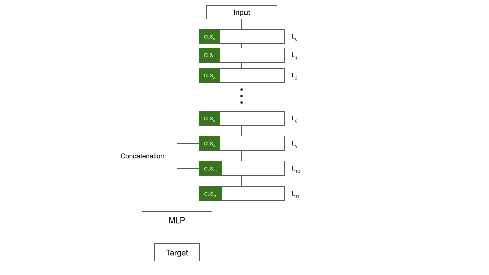

# Huggingface example 

- [x] : Text classification with trainer hugginggface 
- [x] : Text classification with accelerate
- [x] : Text classification using suicao's solution 
- [x] : Text classification using bert + cnn
- [ ] : Token classification
- [ ] : Question Answering
- [ ] : Text generate 
- [ ] : Language Modeling

## Text classification with trainer hugginggface 
```
    python text_classication_run_trainer.py \
    --model_name_or_path xlm-roberta-large \
    --dataset_name your_dataset  \
    --do_train \
    --do_eval \
    --max_seq_length 256 \
    --per_device_train_batch_size 32 \
    --save_steps 5000 \
    --save_total_limit  2 \
    --learning_rate 2e-5 \
    --num_train_epochs 3 \
    --output_dir $(pwd)/output \
    --report_to "wandb"
```

## Text classification using suicao's solution 
We concatenated the last 4 hidden representations of the [CLS] token on top and fed them to simple MLP.




```
    python text_classification_suicao_solution.py \
    --model_name_or_path xlm-roberta-large \
    --dataset_name your_dataset  \
    --do_train \
    --do_eval \
    --max_seq_length 256 \
    --per_device_train_batch_size 32 \
    --save_steps 5000 \
    --save_total_limit  2 \
    --learning_rate 2e-5 \
    --num_train_epochs 3 \
    --output_dir $(pwd)/output \
    --report_to "wandb"
```


## Text classification using Bert + CNN 
```
    python text_clf_with_bert_cnn.py \
    --model_name_or_path xlm-roberta-large \
    --dataset_name your_dataset  \
    --do_train \
    --do_eval \
    --max_seq_length 256 \
    --per_device_train_batch_size 32 \
    --save_steps 5000 \
    --save_total_limit  2 \
    --learning_rate 2e-5 \
    --num_train_epochs 3 \
    --output_dir $(pwd)/output \
    --report_to "wandb"
```

